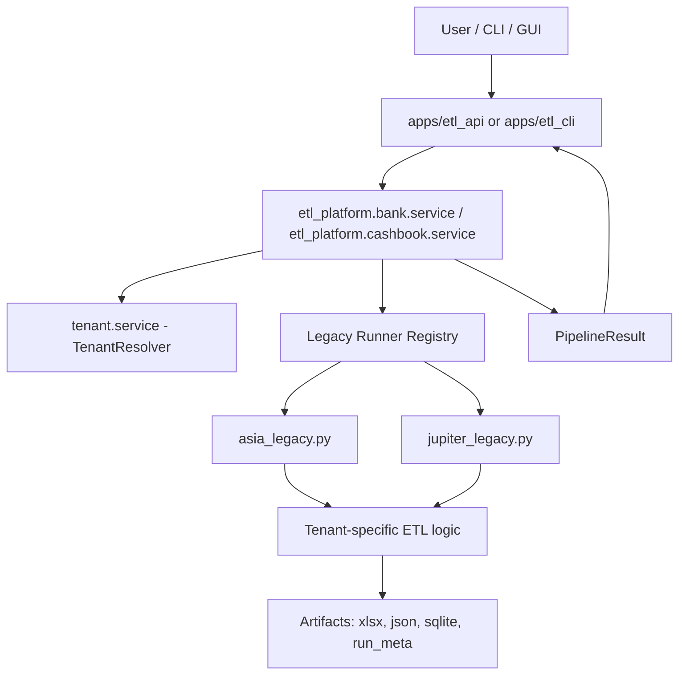

# Restaurant ETL Platform - Software Overview

This document explains the current software structure, runtime flow, and key operational concepts.

## Purpose

The platform processes tenant-specific accounting data for:

- **Bank ETL** (bank statement input, tenant logic, normalized outputs)
- **Cashbook ETL** (cashbook input, tenant logic, normalized outputs)

Current tenants: `asia`, `jupiter`

---

## High-Level Architecture



---

## Main Modules

- `etl_platform/bank/`
  - `service.py`: bank orchestration, runner selection, artifact handling
  - `asia_legacy.py`, `jupiter_legacy.py`: tenant adapter layer
  - `interfaces.py`: request/result/protocol contracts
  - `legacy_common.py`: shared legacy adapter helpers

- `etl_platform/cashbook/`
  - `service.py`: cashbook orchestration, runner registry
  - `asia_legacy.py`, `jupiter_legacy.py`: tenant-specific cashbook logic
  - `interfaces.py`: request/result/protocol contracts

- `etl_platform/tenant/`
  - `service.py`: tenant config resolving and path template expansion

- `apps/etl_api/`
  - WSGI API + browser GUI + async run management

- `apps/etl_cli/`
  - operational scripts: health checks, smoke checks, rules checks

---

## Runtime Flow

1. Caller (API/CLI) builds a module request (`BankRunRequest` or `CashbookRunRequest`)
2. Service resolves tenant config via `TenantResolver`
3. Service chooses tenant runner from registry
4. Runner executes tenant-specific ETL
5. Service writes/collects standardized artifacts
6. Service returns standardized result object (`BankPipelineResult` / `CashbookPipelineResult`)

---

## Inputs and Outputs

### Bank

Input (typical):

- `tenant_id`
- `source_dir`
- `output_path`
- optional `statement_pdf`, `agenda_file`, `sqlite_output_path`

Outputs (typical):

- workbook: `*.xlsx`
- canonical json: `*.processed.json`
- diagnostics json on parse issues: `*.parse_diagnostics.json`
- metadata: `*.run_meta.json`

### Cashbook

Input (typical):

- `tenant_id`
- `input_path`
- `output_path`
- optional `pdf_base_dir`, `sheet_name`, `sqlite_output_path`

Outputs (typical):

- workbook: `*.xlsx`
- sqlite: `*.sqlite`
- metadata: `*.run_meta.json`

---

## Error Handling Model

Module services map failures to structured errors:

- `BankServiceError` + `BankErrorCode`
- `CashbookServiceError` + `CashbookErrorCode`

This keeps API/GUI responses deterministic and easier to diagnose than raw tracebacks.

---

## API and GUI

`apps/etl_api/main.py` provides:

- health endpoint
- ETL run endpoints (async/background)
- run status/history endpoints
- local browser GUI
- local file/folder picker endpoints used by GUI

---

## Tenant Extensibility Pattern

### Recommended for new Bank tenants

- Keep `*_legacy.py` as **adapter**
- Put heavier parsing/transform/export logic in modular tenant package
- Register runner in `BankService`

### Current Cashbook pattern

- More tenant logic currently resides directly in `*_legacy.py`
- Works for existing tenants, but can be modularized later for scale

---

## Operational Commands

### Health check

```bash
python -m Restaurant.apps.etl_cli.health_check
```

CI-friendly namespace-only mode:

```bash
python -m Restaurant.apps.etl_cli.health_check --namespace-only
```

### Unified smoke run

```bash
python -m Restaurant.apps.etl_cli.etl_smoke --module bank --tenant-id asia --source <path> --output <file.xlsx>
python -m Restaurant.apps.etl_cli.etl_smoke --module cashbook --tenant-id asia --source <path> --output <file.xlsx>
```

### CI smoke runner

```bash
python -m Restaurant.apps.etl_cli.ci_smoke --module bank
python -m Restaurant.apps.etl_cli.ci_smoke --module cashbook
```

---

## Notes

- Canonical namespace is `Restaurant.etl_platform`
- Legacy/transitional namespaces were removed from active runtime usage
- CI workflow: `.github/workflows/etl-smoke.yml`

